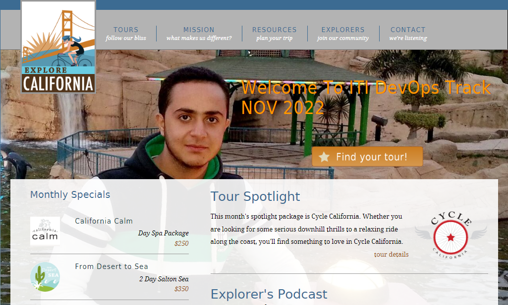

## Table of contents
* [General info](#general-info)
* [Technologies](#technologies)
* [Setup](#setup)

## General info
* This project is simple tour website for booking tickets

## Technologies
* Nginx as Webserver
* HTML
* CSS

## Setup local
* $ docker build -t "Your Image Name " .
* $ docker run -p 80:80 <Your Image Name >
  
## Setup on Kubernates using jenkins pipeline with help of Jenkinsfile
* Create Build Stage to build the image
* Push that image to you repository
* Deploy on your kubernetes cluster using that image
  
  

